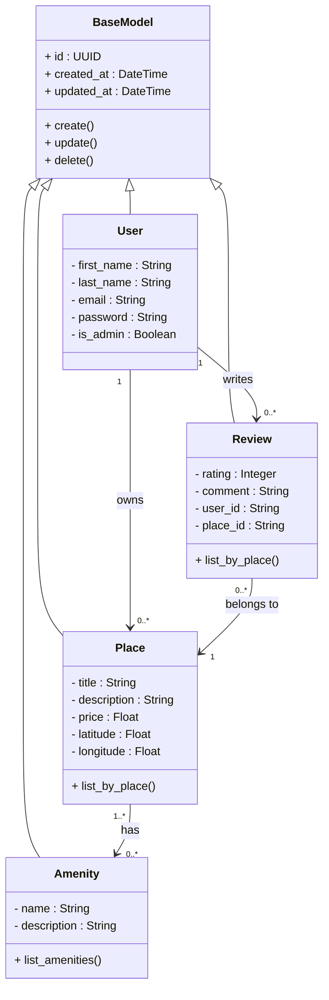

```mermaid
---
config:
  theme: default
---
classDiagram
direction TB
    class User {
	    - first_name : String
	    - last_name : String
	    - email : String
	    - password : String
	    - is_admin : Boolean
	    
    }

    class Review {
	    - rating : Integer
	    - comment : String
	    - user_id : String
	    - place_id : String
	    + list_by_place()
    }

    class BaseModel {
	    + id : UUID
	    + created_at : DateTime
	    + updated_at : DateTime
	    + create()
	    + update()
	    + delete()
    }

    class Amenity {
	    - name : String
	    - description : String
	    + list_amenities()
    }

    class Place {
	    - title : String
	    - description : String
	    - price : Float
	    - latitude : Float
	    - longitude : Float
	    + list_by_place()
    }

    BaseModel <|-- User
    BaseModel <|-- Place
    BaseModel <|-- Review
    BaseModel <|-- Amenity
    User "1" --> "0..*" Place : owns
    User "1" --> "0..*" Review : writes
    Place "1..*" --> "0..*" Amenity : has
    Review "0..*" --> "1" Place : belongs to
```
