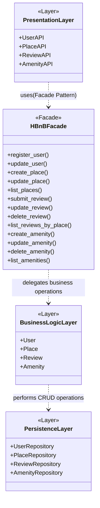

```mermaid
classDiagram
direction TB

class PresentationLayer {
    +UserAPI
    +PlaceAPI
    +ReviewAPI
    +AmenityAPI
}

class HBnBFacade {
    +register_user()
    +update_user()
    +create_place()
    +update_place()
    +list_places()
    +submit_review()
    +update_review()
    +delete_review()
    +list_reviews_by_place()
    +create_amenity()
    +update_amenity()
    +delete_amenity()
    +list_amenities()
}

class BusinessLogicLayer {
    +User
    +Place
    +Review
    +Amenity
}

class PersistenceLayer {
    +UserRepository
    +PlaceRepository
    +ReviewRepository
    +AmenityRepository
}

<<Layer>> PresentationLayer
<<Facade>> HBnBFacade
<<Layer>> BusinessLogicLayer
<<Layer>> PersistenceLayer

PresentationLayer ..> HBnBFacade : uses(Facade Pattern)
HBnBFacade ..> BusinessLogicLayer : delegates business operations
BusinessLogicLayer ..> PersistenceLayer : performs CRUD operations
```
