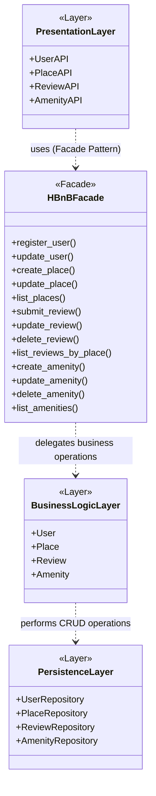
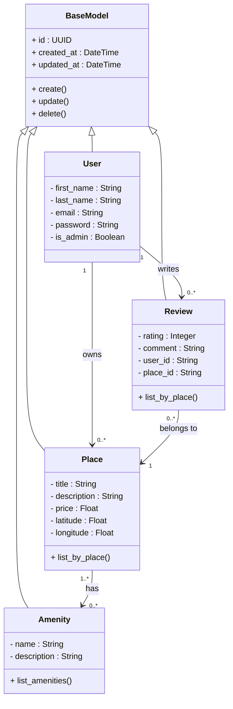
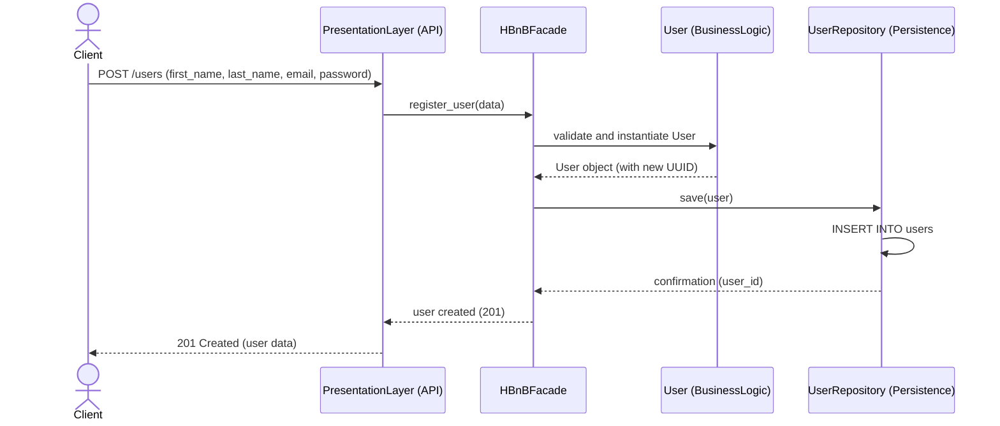
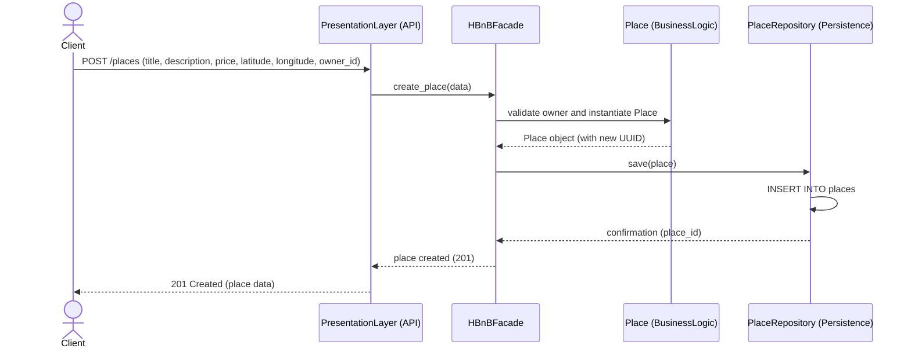
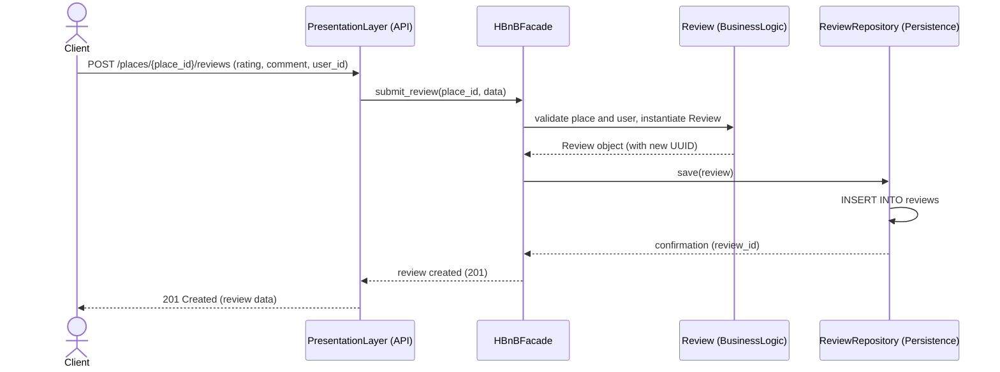
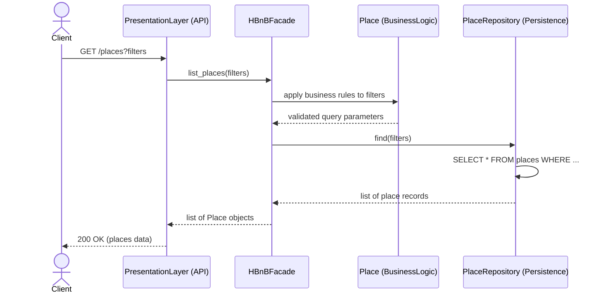

# HBnB Evolution — Part 1: Technical Documentation

**High-Level Architecture, Business Logic Design, and API Interaction Flows**

---

## Table of Contents

1. [Introduction](#1-introduction)
2. [High-Level Architecture](#2-high-level-architecture)
   - [2.1 The Three Layers](#21-the-three-layers)
   - [2.2 The Facade Pattern](#22-the-facade-pattern)
   - [2.3 Package Diagram](#23-package-diagram)
3. [Business Logic Layer](#3-business-logic-layer)
   - [3.1 Class Diagram](#31-class-diagram)
   - [3.2 Entity Descriptions](#32-entity-descriptions)
   - [3.3 Relationships](#33-relationships)
4. [API Interaction Flow](#4-api-interaction-flow)
   - [4.1 User Registration](#41-user-registration)
   - [4.2 Place Creation](#42-place-creation)
   - [4.3 Review Submission](#43-review-submission)
   - [4.4 Fetching a List of Places](#44-fetching-a-list-of-places)

---

## 1. Introduction

This is the technical design for Part 1 of HBnB Evolution, a simplified, Airbnb-style platform. It allows users to register, list properties ("places"), leave reviews on places they have stayed, and attach amenities to listings. The goal of this document is to lay out the architecture before any code is written.

The system is covered from three angles:

- a package diagram showing the layered architecture
- a class diagram for the domain model (Business Logic layer)
- sequence diagrams walking through the main API calls

The first two describe what the system looks like; the third describes how it actually behaves at runtime. Between them you get a full picture of the structure and the flow of data through it.

---

## 2. High-Level Architecture

HBnB Evolution follows a three-layer architecture. Splitting things this way keeps each layer focused on one job and means a change in, say, the database doesn't ripple up into the business rules or the API.

### 2.1 The Three Layers

**Presentation Layer**
This is the entry point — the API endpoints clients hit to register users, manage places, submit reviews, and manage amenities. It handles incoming requests, does basic formatting/validation, and hands everything off to the Business Logic Layer. No business rules live here, and it never talks to the database directly.

**Business Logic Layer**
This is where the actual domain lives: `User`, `Place`, `Review`, and `Amenity`, plus the rules that govern them — validation, relationships, anything that needs to stay consistent. It also handles operations that touch more than one entity, like checking that a review's place and user both actually exist before creating it.

**Persistence Layer**
Handles storing and retrieving data. It's organized as one repository per entity, each translating domain operations into database calls (create, read, update, delete). The actual database tech isn't decided yet — that comes in Part 3 — so for now this layer is kept generic.

### 2.2 The Facade Pattern

The Presentation Layer never talks to the Business Logic Layer directly — everything goes through a single facade, `HBnBFacade`. It exposes one method per operation (`register_user()`, `create_place()`, `submit_review()`, `list_places()`, etc.), so the API doesn't need to know anything about how those operations are actually implemented underneath.

A few reasons this is worth doing:

- **Decoupling** — the API only depends on the facade's interface, not on the internals of the Business Logic Layer, so either side can change without breaking the other.
- **Simpler endpoints** — a multi-step operation (validate owner → create place → persist → confirm) collapses into a single call from the API's point of view.
- **Clear responsibilities** — the facade orchestrates, the models enforce the rules, the repositories handle storage. Nobody's job overlaps.

The Business Logic Layer then talks to the Persistence Layer on its own to actually read or write data.

### 2.3 Package Diagram

**Figure 1 — High-level package diagram** showing the Presentation, Business Logic, and Persistence layers, communicating through the `HBnBFacade`.

The `PresentationLayer` package groups the API endpoints (`UserAPI`, `PlaceAPI`, `ReviewAPI`, `AmenityAPI`). Every call from here goes through `HBnBFacade`, which then delegates to `BusinessLogicLayer` — the four domain models. That layer talks to `PersistenceLayer`, where each entity has its own repository. Notice the Presentation Layer never has a direct line to the Persistence Layer; everything routes through the Business Logic Layer in between.

---

## 3. Business Logic Layer

This layer is built around four entities: **User**, **Place**, **Review**, and **Amenity**. Each one gets a UUID4 `id`, plus `created_at` and `updated_at` timestamps — that part's the same across the board, for auditing.

### 3.1 Class Diagram

**Figure 2 — Detailed class diagram** for the Business Logic layer: User, Place, Review, and Amenity, with their attributes, methods, and relationships.

### 3.2 Entity Descriptions

**User**
A registered account on the platform — first name, last name, email, password, plus an `is_admin` flag to tell regular users apart from admins. Users inherit core lifecycle actions from BaseModel One user can own several places and write several reviews.

**Place**
A property listing created by a user — title, description, price, latitude, longitude. Every place has exactly one owner. Places support core lifecycle actions alongside a specific list_by_place() method, can have any number of amenities attached, and can receive any number of reviews.

**Review**
Feedback a user leaves on a place they've stayed at — a rating and a comment. Every review points to exactly one place (place_id) and one user (user_id). Reviews can be created, updated, deleted, and listed per place via list_by_place().

**Amenity**
A feature a place can offer — Wi-Fi, parking, a pool, whatever. Just a name and a description. Amenities support core lifecycle actions and can be listed via list_amenities().

### 3.3 Relationships

| Relationship | Multiplicity | Type | Description |
|---|---|---|---|
| User → Place | 1 to 0..* | Association | A User owns zero or more Places; each Place has exactly one owner. |
| User → Review | 1 to 0..* | Association | A User writes zero or more Reviews; each Review has exactly one author. |
| Review → Place | 0..* to 1 | Association | A Review belongs to exactly one Place; a Place can receive zero or more Reviews. |
| Place → Amenity | 0..* to 0..* | Association | A Place can have many Amenities, and an Amenity can be associated with many Places. |

All four entities inherit from BaseModel and carry the same base fields - a UUID id, created_at, and updated_at timestamps - alongside standard lifecycle methods ( create(), update(), delete() ) so every record can be uniquely managed and traced over time.

---
## 4. API Interaction Flow

This section walks through four representative API calls and how a request moves through the system: client → Presentation Layer → `HBnBFacade` → Business Logic Layer → Persistence Layer, and back. The Presentation Layer only ever talks to the facade, as described in Section 2.

### 4.1 User Registration

The client sends new user details to the API. The facade hands the data to the `User` model to validate and instantiate; once a `User` object exists with a fresh UUID, the facade tells `UserRepository` to save it. Confirmation flows back up through the facade and API to the client.

**Figure 3 — Sequence diagram for the User Registration API call.**

#### API Call Description

This API call creates a new user account by validating the submitted information, generating a unique identifier, storing the new user in the database, and returning a successful creation response. The purpose of this sequence diagram is to illustrate how the Presentation, Business Logic, and Persistence layers collaborate to process a user registration request while maintaining separation of concerns.

#### Flow of Interactions

1. The client sends a `POST /users` request to the Presentation Layer.
2. The Presentation Layer forwards the request to the `HBnBFacade`.
3. The facade invokes the `User` model to validate the data and create a new `User` object.
4. The `UserRepository` stores the new user in the database.
5. A confirmation is returned through the facade and Presentation Layer.
6. The client receives a **201 Created** response containing the new user information.

---

### 4.2 Place Creation

The client sends place details, including who owns it. The facade passes this to the `Place` model, which validates and creates a new `Place` object. The facade saves it via `PlaceRepository` and sends a confirmation back.

**Figure 4 — Sequence diagram for the Place Creation API call.**

#### API Call Description

This API call creates a new place listing for an existing user. It validates the provided information, creates a `Place` object, stores it in the database, and returns the newly created resource. The purpose of this sequence diagram is to demonstrate how the application's layered architecture processes a place creation request from start to finish.

#### Flow of Interactions

1. The client sends a `POST /places` request.
2. The Presentation Layer forwards the request to the `HBnBFacade`.
3. The facade calls the `Place` model to validate the owner and create a new `Place` object.
4. The `PlaceRepository` persists the object in the database.
5. The repository returns a confirmation to the facade.
6. The Presentation Layer returns a **201 Created** response to the client.

---

### 4.3 Review Submission

The client sends a rating and comment for a place. The facade passes this to the `Review` model, which checks that the place and user both exist before creating the `Review` object. The facade saves it through `ReviewRepository` and confirms back to the client.

**Figure 5 — Sequence diagram for the Review Submission API call.**

#### API Call Description

This API call allows a user to submit a review for a specific place. Before storing the review, the system validates that both the user and the place exist. The purpose of this sequence diagram is to show how validation, business logic, and data persistence interact to process a review submission.

#### Flow of Interactions

1. The client submits a review through the API.
2. The Presentation Layer forwards the request to the `HBnBFacade`.
3. The facade delegates validation to the `Review` model.
4. After successful validation, the `ReviewRepository` stores the review.
5. The repository returns confirmation to the facade.
6. The client receives a **201 Created** response containing the newly created review.

---

### 4.4 Fetching a List of Places

The client requests places, optionally with filters (price range, location, etc.). The facade passes the filters to the `Place` model to apply any business rules, then queries `PlaceRepository`. The resulting list flows back through the facade, the API, and finally to the client.

**Figure 6 — Sequence diagram for the Fetching a List of Places API call.**

#### API Call Description

This API call retrieves a list of places that match optional filtering criteria supplied by the client. The filters are validated before querying the database. The purpose of this sequence diagram is to illustrate the complete request-response flow through each architectural layer during a read operation.

#### Flow of Interactions

1. The client sends a `GET /places` request with optional filters.
2. The Presentation Layer forwards the request to the `HBnBFacade`.
3. The facade asks the `Place` model to validate the filtering parameters.
4. The `PlaceRepository` queries the database using the validated filters.
5. The matching place records are returned to the facade.
6. The Presentation Layer sends a **200 OK** response containing the list of places back to the client.
