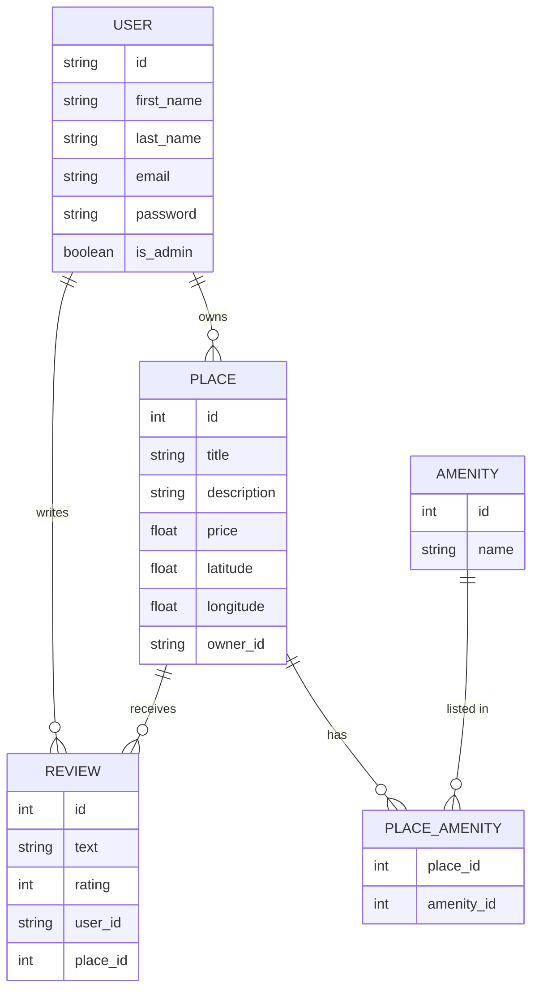

# HBnB Database Schema - Entry Relationship Diagram

```mermaid
---
config:
  theme: default
---
erDiagram
	direction TB
	USER {
		string id  ""  
		string first_name  ""  
		string last_name  ""  
		string email  ""  
		string password  ""  
		boolean is_admin  ""  
	}

	PLACE {
		int id  ""  
		string title  ""  
		string description  ""  
		float price  ""  
		float latitude  ""  
		float longitude  ""  
		string owner_id  ""  
	}

	REVIEW {
		int id  ""  
		string text  ""  
		int rating  ""  
		string user_id  ""  
		int place_id  ""  
	}

	PLACE_AMENITY {
		int place_id  ""  
		int amenity_id  ""  
	}

	AMENITY {
		int id  ""  
		string name  ""  
	}

	USER||--o{PLACE:"owns"
	USER||--o{REVIEW:"writes"
	PLACE||--o{REVIEW:"receives"
	PLACE||--o{PLACE_AMENITY:"has"
	AMENITY||--o{PLACE_AMENITY:"listed in"
```
